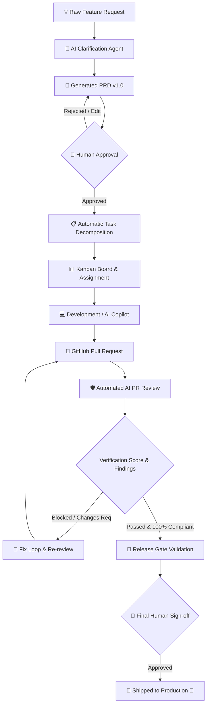

# 🚀 Product Requirements Document (PRD)
## **VelocityAI — Autonomous Product Delivery Cockpit**

| **Document Metadata** | **Details** |
|:---|:---|
| **Product Name** | **VelocityAI** (Internal Core: `shipflow-ai`) |
| **Document Version** | `v1.0.0` (Production Master Spec) |
| **Product Stage** | Production / Live |
| **Live URL** | [https://my-ai-code-reviewer.onrender.com](https://my-ai-code-reviewer.onrender.com) |
| **Owner / Lead** | [@Mr-Madhukar](https://github.com/Mr-Madhukar) |
| **Target Audience** | Engineering Managers, Founders, Product Managers, Full-Stack Engineers |

---

## 1. 📌 Executive Summary & Product Vision

### 1.1 The Problem
Software development teams face severe friction between ideation and release:
1. **Ambiguous Requirements**: Feature ideas start as messy thoughts, half-baked Slack messages, or vague tickets, leading to scope creep and misalignment.
2. **Manual Planning Overhead**: Engineering leads spend hours decomposing PRDs into granular tasks, sizing efforts, and assigning them according to team specialties.
3. **Disconnected Code Reviews**: Traditional code reviews focus on syntax, linting, or personal stylistic preferences rather than verifying whether the code actually satisfies the original PRD acceptance criteria.
4. **Broken Feedback Loops**: When PR reviews uncover issues, engineers must manually cross-reference findings, draft fixes, and re-request reviews, causing delays.
5. **Fragmented Toolchain**: Teams juggle Jira/Linear (tickets), Notion/Google Docs (PRDs), GitHub (code & PRs), and external review bots without unified synchronization.

### 1.2 The Solution
**VelocityAI** is an all-in-one, AI-assisted product delivery cockpit that compresses the entire lifecycle from raw feature concept to production-shipped code. VelocityAI automates structured, repetitive tasks—clarifying requests, generating PRDs, decomposing tasks, reviewing PRs against requirements, and even drafting pull request fixes—while leaving critical business approvals firmly in human hands.

```
┌──────────────────────────────────────────────────────────────────────────────────────────┐
│                               VELOCITYAI END-TO-END PIPELINE                             │
├─────────────┬─────────────┬─────────────┬─────────────┬─────────────┬────────────────────┤
│ 1. DISCOVER │ 2. DOCUMENT │ 3. BREAKDOWN│ 4. CODE GEN │ 5. QA AUDIT │ 6. RELEASE GATE    │
│  Raw Idea   │ AI PRD Gen  │ Auto Tasks  │ AI Copilot  │ GitHub PR   │ Strict Checklist & │
│  + PM Agent │ + PDF & Mail│ & Kanban    │ (Draft PR)  │ Review Bot  │ Production Ship 🚢 │
└─────────────┴─────────────┴─────────────┴─────────────┴─────────────┴────────────────────┘
```

---

## 2. 👥 User Personas & Target Audiences

| Persona | Role | Key Pain Points | VelocityAI Value Proposition |
|:---|:---|:---|:---|
| **Priya (Product Manager)** | Defines roadmap, writes specs, aligns stakeholders | Spends 10+ hours/week writing PRDs; engineers frequently misinterpret requirements | Interactive AI clarification agent asks sharp discovery questions and writes comprehensive, structured PRDs with exportable PDFs in seconds. |
| **Alex (Engineering Lead)** | Architects systems, assigns work, enforces quality | Difficulty breaking features into clean tasks; reviewing PRs takes too much time | Automated task decomposition mapped to engineer specialties; automated AI code reviews validating every acceptance criterion before human merge. |
| **Rohan (Senior / Staff Engineer)** | Implements features, writes PRs, fixes bugs | Context switching between tickets and code; review cycles stall on minor edge cases | Built-in AI Copilot that drafts implementations directly against repo context; automated inline PR feedback identifying exact lines violating the PRD. |
| **David (Founder / CTO)** | Manages resources, tracks velocity, signs off on releases | Uncontrolled release quality; lack of visibility on team velocity and billing | Org-scoped visibility, strict multi-step release gates, metered AI review credits with transparent Razorpay billing. |

---

## 3. 🔄 The Core End-to-End Workflow



---

## 4. 🧩 Core Product Capabilities & Functional Requirements

### 4.1 Feature Ingestion & AI Clarification Engine
* **Input**: Natural-language feature prompts submitted via the modern dashboard.
* **Interactive Clarification Agent**:
  * An autonomous product-manager agent reviews the prompt and identifies gaps, ambiguities, and edge cases.
  * Conducts a targeted Q&A dialogue with the submitter before locking the scope.
  * Preserves full conversation context across iterations.

### 4.2 Automated PRD Generation & Living Document Studio
* **Structured Output Engine**:
  * Generates industry-grade PRDs containing: Executive Problem Statement, Core Goals & Non-Goals, User Personas & Stories, Numbered Acceptance Criteria, Technical Edge Cases, Security Considerations, and Estimated Hours.
* **Living Studio**:
  * Rich markdown editor with live preview, diff tracking, and version increments (`v1.0`, `v1.1`, etc.).
  * In-place AI revision: "Expand on security risks", "Add rate-limiting criteria".
* **Export & Collaboration**:
  * **On-the-fly PDF Generation**: Generates styled, branded PDF copies of the PRD.
  * **Email Dispatch**: Direct team sharing via Resend with PDF attached.

### 4.3 Task Decomposition & Smart Kanban Engine
* **Specialty-Aware Task Generation**:
  * When a PRD is approved, Inngest triggers an automated decomposition job.
  * Tasks are categorized by domain (`frontend`, `backend`, `database`, `devops`, `qa`).
  * Estimates complexity (Story Points and Hours) and assigns them to teammates based on their registered expertise.
* **Interactive Kanban Board**:
  * Columns: `Backlog`, `In Progress`, `In Review`, `Done`.
  * Real-time drag-and-drop status syncing via Pusher WebSockets.

### 4.4 GitHub App Integration & Autonomous PR Auditing
* **Bi-directional Webhook Ingestion**:
  * Listens for `pull_request` (`opened`, `synchronize`, `reopened`) events.
  * Validates HMAC `x-hub-signature-256` signatures against `GITHUB_WEBHOOK_SECRET`.
* **Automated AI Acceptance-Criteria Reviewer**:
  * Pulls PR diffs, commit logs, and modified files via Octokit.
  * Evaluates code changes against **every single acceptance criterion** defined in the linked PRD.
  * Assigns an overall **Compliance Score (0–100%)** and verdict (`Approved` vs `Changes Requested`).
  * Posts structured findings directly as GitHub PR review comments, categorized by severity:
    * 🔴 **Blocking**: Must be resolved before merging.
    * 🟡 **Warning**: Potential architectural or performance risk.
    * 🟢 **Positive**: Praises clean, well-tested implementations.
* **Commit Status Checks**:
  * Sets GitHub commit status check: `VelocityAI/prd-compliance` (`pending`, `success`, or `failure`).

### 4.5 AI Copilot Studio (Build / Fix / Improve)
* **Repository Context Indexing**:
  * Ingests repo trees, symbols, and core structures into semantic cache.
* **Three Operational Modes**:
  1. **Build**: Turns a feature prompt or PRD task into clean, multi-file code plans.
  2. **Fix**: Ingests failed PR review findings and automatically generates code patches addressing each issue.
  3. **Improve**: Refactors code for performance, test coverage, and documentation.
* **Autonomous Branch & Draft PR Creation**:
  * Ability to commit patches to a new branch (`velocity/{featureId}`) and open a draft GitHub PR automatically.

### 4.6 Strict Release Gate & Production Ship Cockpit
* **4-Point Release Checklist**:
  1. PRD Approved by an authorized team member.
  2. All engineering tasks moved to `Done`.
  3. Linked GitHub PR merged with all blocking AI review issues resolved.
  4. Explicit human sign-off recorded with audit timestamp.
* **Shipped Audit Trail**:
  * Locks the feature status to `shipped`.
  * Dispatches real-time broadcast and notification to all organization members.

### 4.7 Multi-Tenant RBAC & Organization Isolation
* **Isolation**: All domain tables enforce `organization_id` foreign keys with database-level cascading.
* **Roles**:
  * `Owner`: Billing, organization deletion, member removal.
  * `Admin`: Plan upgrades, GitHub app installation, feature approvals.
  * `Member`: Feature submission, task completion, Copilot runs.
* **Branded Email Invites**: Secure 7-day invite tokens sent via Resend with auto-acceptance on registration.

### 4.8 Metered Billing & Razorpay Credits Engine
* **Credit Consumption**: Each automated AI PR review consumes 1 AI Review Credit.
* **Plan Tiers**:
  * **Free**: 1 Repository, 10 Review Credits/month, 2 Seats.
  * **Pro**: Unlimited Repositories, 100 Review Credits/month, 5 Seats.
  * **Scale**: Unlimited Repositories, 500 Review Credits/month, Unlimited Seats.
* **Webhook Idempotency**: Processed via `processed_webhook_event` ledger table with HMAC signature validation.

---

## 5. 🏗️ System Architecture & Monorepo Structure

```
VelocityAI (Turborepo Monorepo)
├── apps/
│   └── web/                               # Next.js 16 (App Router)
│       ├── app/                           # React 19 UI & Pages
│       │   ├── (auth)/                    # Sign-in, sign-up, verification
│       │   ├── (protected)/               # Dashboard, features, kanban, billing
│       │   └── api/                       # Route handlers (tRPC, webhooks, auth)
│       ├── features/                      # Domain features (ai, copilot, github, inngest)
│       ├── hooks/                         # React hooks (useOrgRealtime, trpc)
│       └── lib/                           # Clients (auth, email, github, realtime)
└── packages/
    ├── database/                          # Drizzle ORM schemas, migrations, Neon client
    ├── trpc/                              # Type-safe tRPC Server routers & procedures
    ├── services/                          # Pure deterministic business logic & unit tests
    ├── logger/                            # Structured loggers
    └── typescript-config/                 # Strict TS configs
```

---

## 6. 💾 Database Entity Relationship Overview

| Table | Primary Purpose | Key Fields & Foreign Keys |
|:---|:---|:---|
| `users` | Core user identity | `id`, `name`, `email`, `image`, `role` |
| `organizations` | Tenant boundary | `id`, `name`, `slug`, `logo`, `created_by` |
| `members` | Org membership & roles | `id`, `organization_id`, `user_id`, `role` |
| `feature_requests` | Core feature unit | `id`, `organization_id`, `title`, `description`, `status` |
| `prds` | Living requirements document | `id`, `feature_id`, `version`, `content`, `status`, `approved_by` |
| `tasks` | Actionable work items | `id`, `feature_id`, `title`, `domain`, `status`, `assigned_to` |
| `github_installations` | GitHub App connections | `id`, `installation_id`, `account_login`, `account_id` |
| `repositories` | Connected repos | `id`, `organization_id`, `github_repo_id`, `full_name` |
| `pull_requests` | Synced pull requests | `id`, `repository_id`, `number`, `title`, `head_sha`, `state` |
| `review_cycles` | Audit runs for a PR | `id`, `pull_request_id`, `status`, `compliance_score`, `summary` |
| `review_issues` | Specific review findings | `id`, `review_cycle_id`, `severity`, `file_path`, `suggestion` |
| `subscriptions` | Razorpay billing state | `id`, `organization_id`, `plan_id`, `credits_balance`, `status` |

---

## 7. 🛡️ Security, Reliability & Compliance

1. **Defense-in-Depth Authentication**: Edge middleware optimistic cookie checks coupled with database-authoritative session validation via BetterAuth.
2. **Webhook Integrity**:
   * GitHub Webhooks verified using HMAC-SHA256 (`x-hub-signature-256`).
   * Razorpay Webhooks verified using HMAC-SHA256 signatures with duplicate-event deduplication.
3. **Resilient Background Execution**:
   * Long-running generation handled via **Inngest** durable execution.
   * Seamless **Inline Fallbacks** ensuring code reviews never drop even during external queue outages.
4. **Data Isolation**: Strict multi-tenant row isolation across all database operations.

---

## 8. 📊 Success Metrics & Key Performance Indicators (KPIs)

* **Cycle Time Reduction**: Decrease average time from feature prompt to production-ready PR from 5 days to < 4 hours.
* **Specification Quality**: Zero unhandled critical edge cases in PRDs generated by the AI Clarification Agent.
* **Review Accuracy**: > 95% alignment between VelocityAI compliance verdicts and senior engineer code approvals.
* **Platform Availability**: 99.9% uptime for API route handlers and durable workflow consumers.
